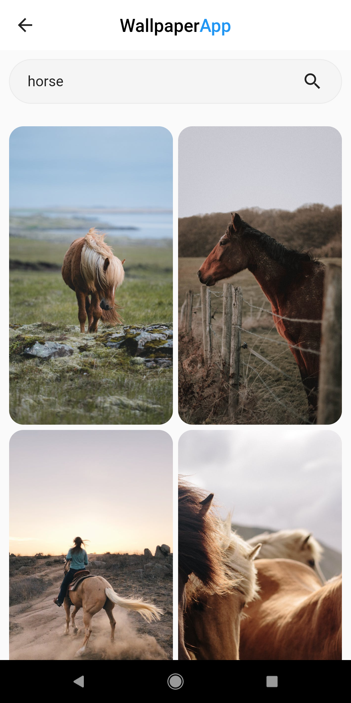

# Wallpaper App devloped using Flutter and pexels API

## Features 
- Latest Wallpapers
- Filter wallpapers by category
- Search Wallpapers

### Note: Replace the apiKey with your own apiKey
- Create free account on <a href="https://www.pexels.com/">pexels</a> and get your apiKey
- Replace this apiKey with the apiKey present in <a href="lib/data/data.dart">data.dart</a> file with apiKey variable

&emsp;&emsp;

&emsp;
